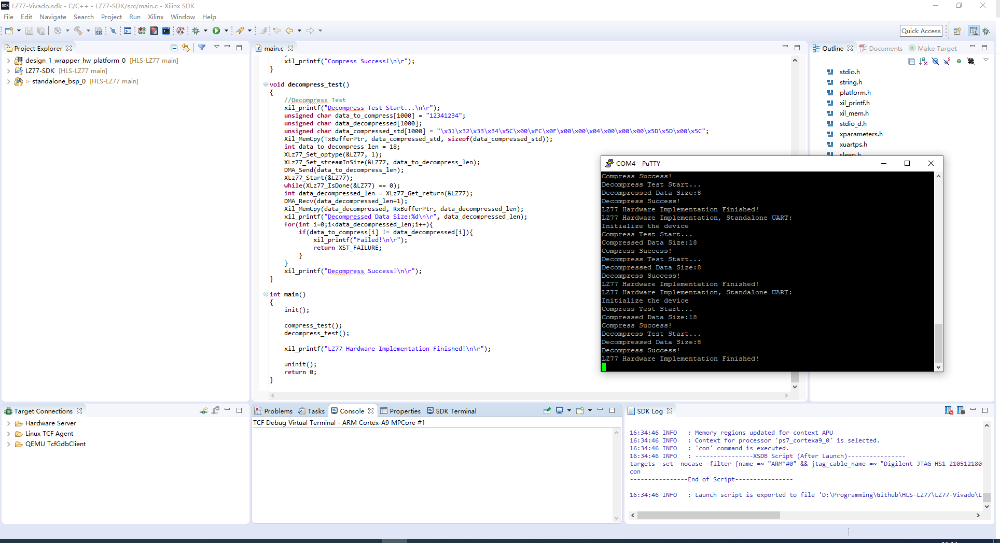

# HLS-LZ77
**This is a repo of HLS Implementation of LZ77 Data Compression Algorithm, which is a project for *The 2nd winter camp of domain-oriented customized computing* (*2021 Xilinx Winter Camp*).**

## Proposal of Project
HLS-LZ77 is going to implement LZ77 data compression algorithm on Zynq-7000 FPGA using Vivado HLS. 

The implementation of this project will be split into two parts, PS (Processing System) and PL (Programmable Logic). 

In order to speed up the compression progress, LZ77 algorithm will be done on the PL side. For the sake of rapid iteration, the usage of HLS (High-Level Synthesis) is required for hardware development. 

PS will be responsible for human-computer interaction. The software part will be implemented in SDK at least, whose OS platform is standalone. If possible, software will also be realized on a PetaLinux release.

PS and PL will communicate via AXI (Advanced eXtensible Interface) Bus.

## Platform
- ALinx AX7020 FPGA Development Board (with Zynq-7000 series XC7X020-2CLG400I)
- Vivado 2018.3
- Vivado HLS 2018.3
- Vivado SDK 2018.3

## Project Achievements
The project has achieved its desired results. LZ77 algorithm has been implemented on the PL side and software part is implemented in SDK. 

Besides AXI Bus, DMA & AXIS is also used to interchange data between PS and PL.

## Sources
Vivado HLS: [LZ77-HLS/](LZ77-HLS/)

Vivado: [LZ77-Vivado/LZ77-Vivado.srcs/](LZ77-Vivado/LZ77-Vivado.srcs/)

Vivado SDK: [LZ77-Vivado/LZ77-Vivado.sdk/LZ77-SDK/src/](LZ77-Vivado/LZ77-Vivado.sdk/LZ77-SDK/src/)

## Software Implementation
x86 arch: [bjrjk/LZ77-Demo](https://github.com/bjrjk/LZ77-Demo)

## Development Notes
[Zynq 高层次综合HLS 项目开发经历(1) 概要](https://renjikai.com/zynq-hls-project-development-1/)

[Zynq 高层次综合HLS 项目开发经历(2) LZ77 x86软件实现](https://renjikai.com/zynq-hls-project-development-2/)

[Zynq 高层次综合HLS 项目开发经历(3) 代码移植及Vivado HLS的使用](https://renjikai.com/zynq-hls-project-development-3/)

[Zynq 高层次综合HLS 项目开发经历(4) Vivado IP Integrator](https://renjikai.com/zynq-hls-project-development-4/)

[Zynq 高层次综合HLS 项目开发经历(5) SDK UART串口及DMA代码](https://renjikai.com/zynq-hls-project-development-5/)

